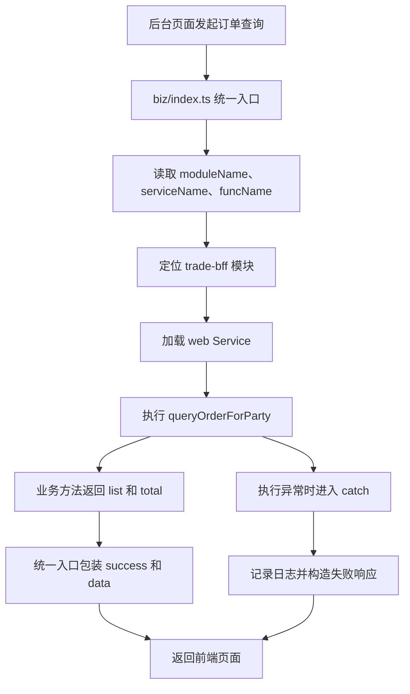

# Day 2：biz 统一入口调用链图

## 一日聚订单列表调用链



## 路由字段示例

```text
moduleName = trade-bff
serviceName = web
funcName = queryOrderForParty
```

对应关系：

```text
trade-bff
→ service/web
→ queryOrderForParty(param, userContext)
```

## 简化记忆

```text
前三个路由字段负责“找谁”
param 负责“让业务方法做什么”
```

## 职责划分

```text
biz/index.ts：
路由、日志、异常处理、响应包装、上下文清理

queryOrderForParty：
处理筛选条件、查询列表和总数、补充关联数据、组装结果
```
