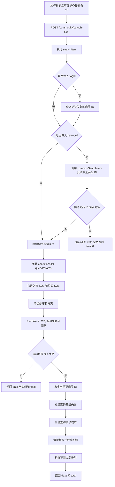

# Day 3：商品检索接口调用链图

## searchItem 完整调用链



## 简化版调用链

```text
旅行社商品页面
→ /commodity/search-item
→ searchItem
→ 关键词或标签转换成候选商品 ID
→ 动态筛选
→ 排序分页
→ 列表和总数并行查询
→ 批量补充头图和城市
→ 返回 data + total
```

## 面试讲解重点

1. 关键词和标签不是直接拼 SQL，而是先转换成候选商品 ID。
2. 价格、行程天数、供给来源等参数会继续组成结构化筛选条件。
3. 排序和分页在后端完成，前端只消费结果。
4. 列表和总数通过 Promise.all 并行查询。
5. 头图和城市使用批量补充，避免逐个商品查询。
6. 最终返回统一的 data + total，方便前端渲染列表和分页。