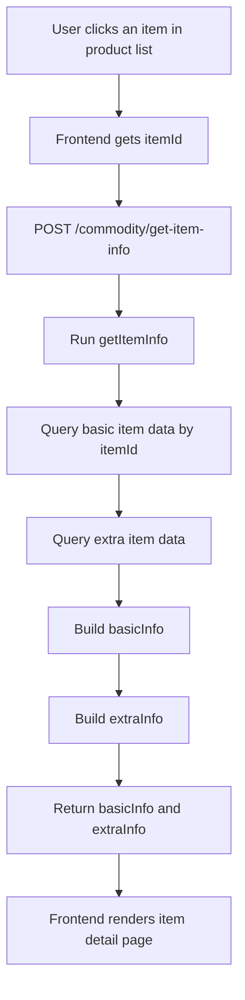

# Day04: getItemInfo Call Chain

## getItemInfo full call chain



## Simplified call chain

```text
Product list page
→ user clicks one item
→ frontend gets itemId
→ request get-item-info
→ backend queries item detail
→ build basicInfo + extraInfo
→ return to frontend
→ render detail page
```

## 中文讲解

这个图表达的是商品详情页的调用链：

1. 用户先在商品列表页点击某个商品。
2. 前端从列表数据里拿到 `itemId`。
3. 前端请求 `POST /commodity/get-item-info`。
4. 后端执行 `getItemInfo`。
5. 后端根据 `itemId` 查询商品基础信息和扩展信息。
6. 最后组装成 `basicInfo + extraInfo` 返回给前端。
7. 前端根据这两个模块渲染商品详情页。

## 面试讲解重点

1. `getItemInfo` 是详情接口，不是搜索接口。
2. 它只需要 `itemId`，因为商品已经在列表页被选中了。
3. `basicInfo` 放商品基础字段。
4. `extraInfo` 放详情扩展字段。
5. 拆成两个模块方便前端按模块渲染，也方便后续扩展。