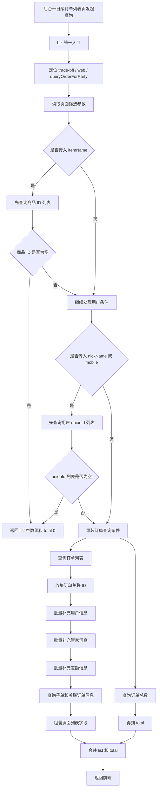

# Day05：一日聚订单列表调用链图

## queryOrderForParty 完整调用链



## 简化版调用链

```text
后台订单列表页
→ queryOrderForParty
→ 页面参数转换成查询条件
→ 商品名转 itemId
→ 用户信息转 unionId
→ 查询订单列表和总数
→ 补充用户、管家、差额、子单等信息
→ 返回 list + total
```

## 面试讲解重点

1. `queryOrderForParty` 是后台一日聚订单列表接口。
2. 它不是简单查订单表，而是 BFF 层的查询编排接口。
3. 商品名会先转换成 `itemIdList`。
4. 用户昵称或手机号会先转换成 `unionIdList`。
5. 订单列表和订单总数分别用于页面表格和分页。
6. 订单查出来后，还要补充用户、管家、差额、子单等页面展示信息。
7. 空结果返回 `list=[]、total=0`，不是系统异常。