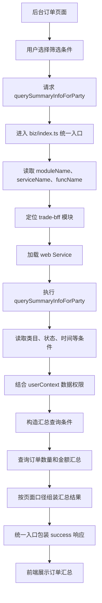

# Day06：订单汇总接口调用链

## 完整调用链



## 简化版调用链

```text
后台选择筛选条件
→ 请求 querySummaryInfoForParty
→ biz 统一入口
→ trade-bff / web
→ 构造汇总条件
→ 查询数量和金额
→ 组装汇总结果
→ 返回前端
```

## 面试讲解重点

1. 汇总接口返回的是统计结果，不是当前页订单列表。
2. 汇总条件可能同时包含页面筛选条件和用户数据权限。
3. 汇总口径不一定等于当前页 `list` 的简单相加。
4. 列表接口和汇总接口可以并行调用，但统计口径必须保持一致。