\# Day07：订单详情接口调用链


\## 完整调用链

```mermaid

flowchart TD

    A\["订单列表页面"] --> B\["用户点击订单详情"]

    B --> C\["前端取得 tradeOrderId"]

    C --> D\["请求 getOrderById"]

    D --> E\["进入 biz/index.ts 统一入口"]

    E --> F\["读取路由字段"]

    F --> G\["定位 trade-bff / web"]

    G --> H\["执行 getOrderById"]

    H --> I\["校验订单 ID 和用户权限"]

    I --> J\["查询订单基础信息"]

    J --> K\["查询商品信息"]

    K --> L\["查询履约信息"]

    L --> M\["查询旅游和出行信息"]

    M --> N\["查询拼团或关联订单信息"]

    N --> O\["按页面模块组装订单详情"]

    O --> P\["统一入口包装响应"]

    P --> Q\["前端渲染详情页面"]

```





\## 简化版调用链


```text

订单列表点击详情

→ 取得 tradeOrderId

→ 请求 getOrderById

→ 校验权限

→ 查询订单基础信息

→ 补充商品、履约和旅游信息

→ 组装详情页模型

→ 返回前端

```


\## 面试讲解重点


1\. `tradeOrderId` 用于定位具体订单。

2\. 详情接口不是只查询一张订单表，而是页面聚合接口。

3\. BFF 根据页面需要组装多个业务模块的数据。

4\. 即使知道订单 ID，也必须结合 `userContext` 校验数据权限。

5\. 某些非核心模块为空，不一定代表接口整体失败。

