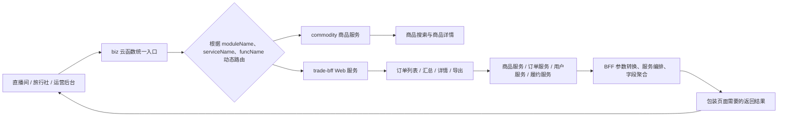

# Day 1 系统调用链总览

## 一、项目整体调用链



## 二、路由协议示例

```text
moduleName  = trade-bff
serviceName = web
funcName    = queryOrderForParty
```

这三个字段共同决定本次请求最终执行哪个业务方法。

对应链路：

```text
页面请求
→ biz/index.ts
→ 解析 moduleName、serviceName、funcName
→ 加载 trade-bff/service/web.ts
→ 执行 queryOrderForParty
→ 查询并聚合订单相关数据
→ 返回 list + total
```

## 三、核心理解

1. `biz/index.ts` 是统一入口和路由分发器，不是真正的订单查询实现。
2. `moduleName + serviceName + funcName` 是动态路由协议。
3. `trade-bff` 位于前端页面和多个后端领域服务之间。
4. BFF 主要负责参数转换、服务编排、数据聚合和页面模型组装。